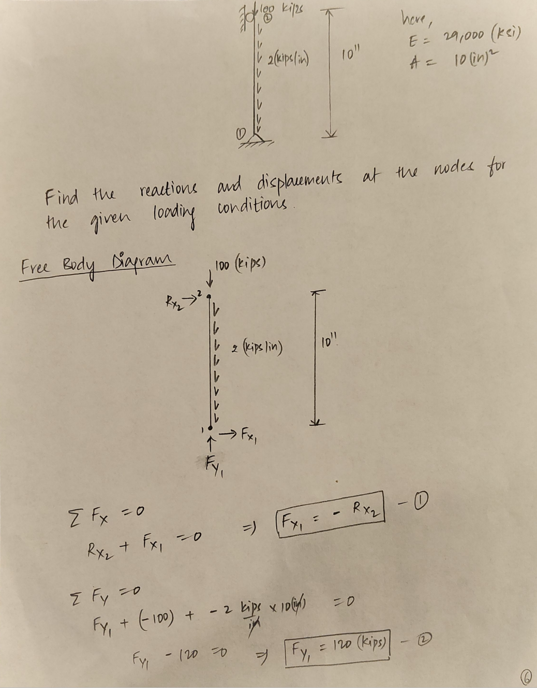
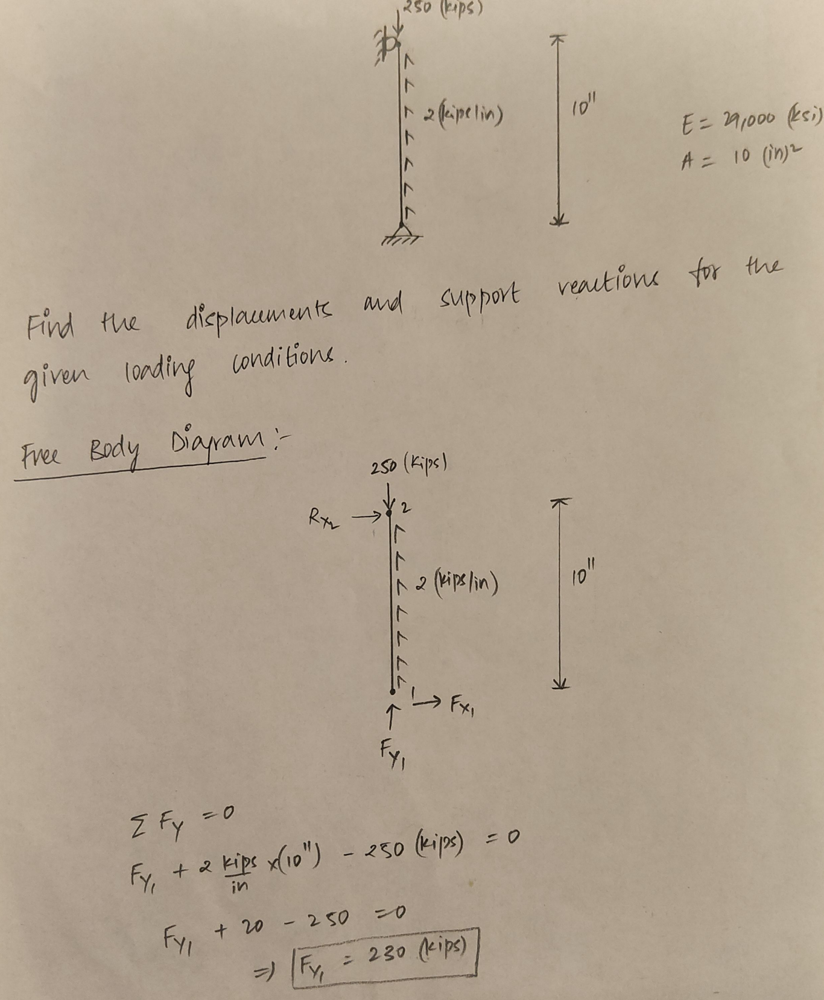
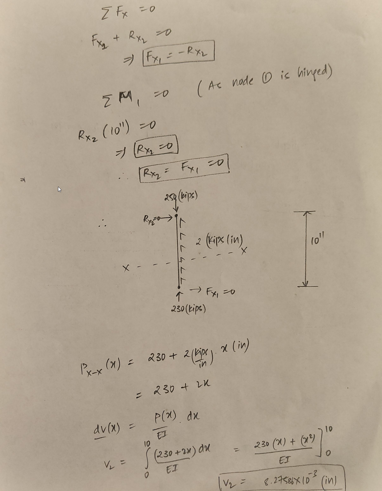
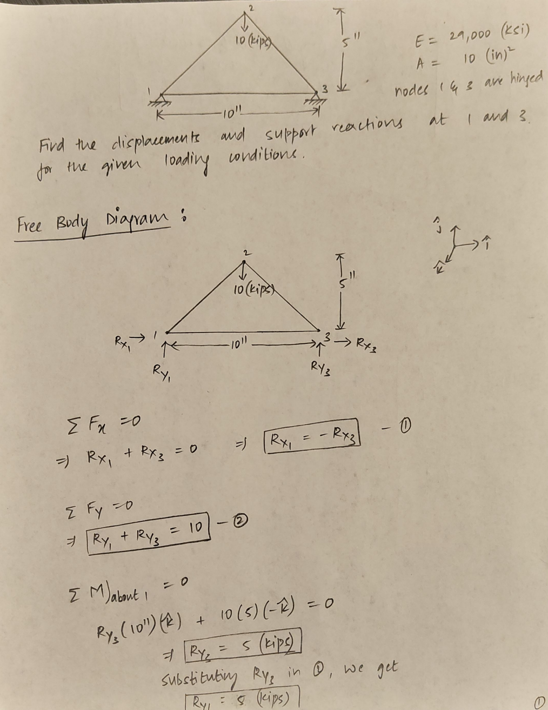
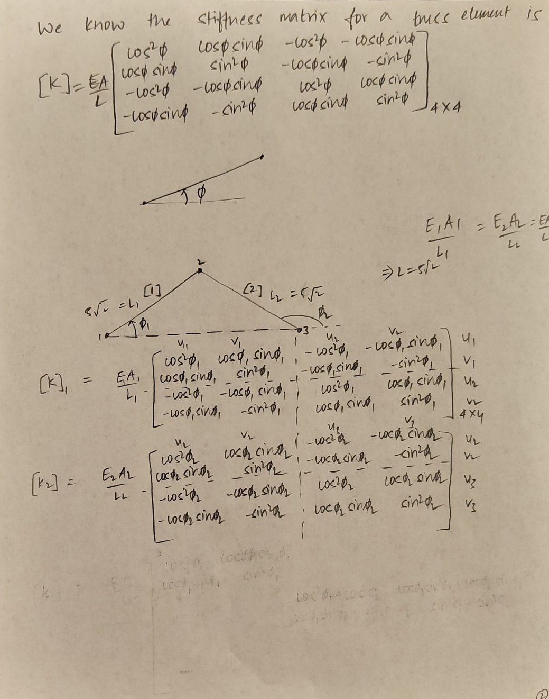
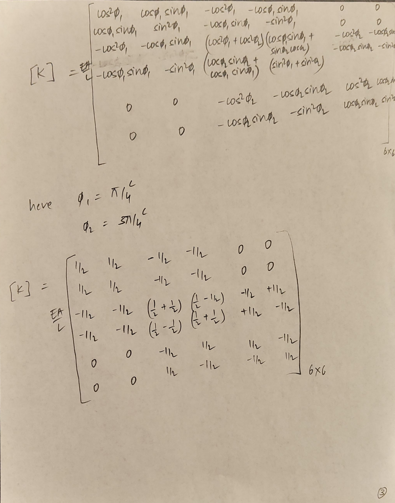
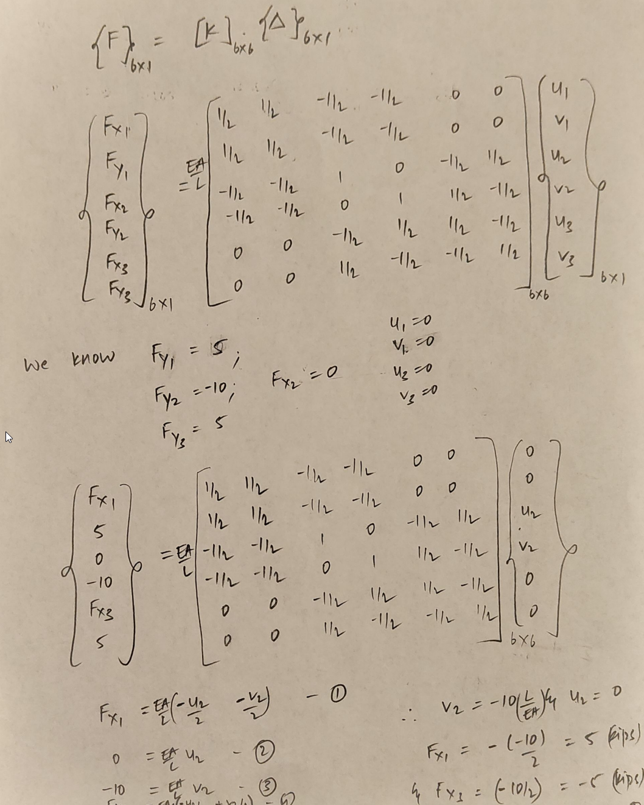
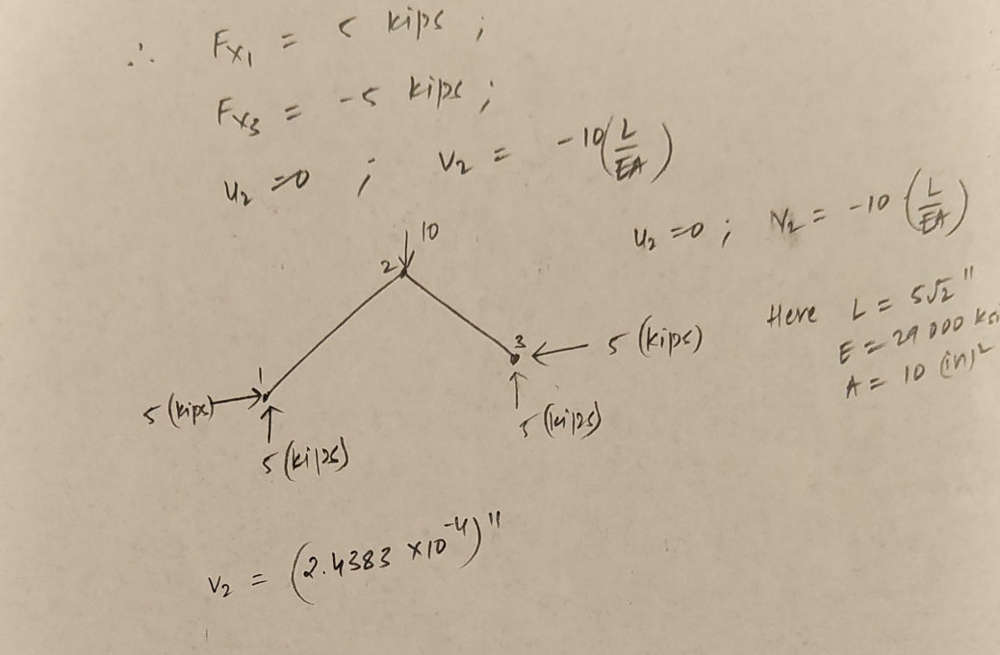

# CEE 512 Class Project - Part 1 Report
### Purpose

The purpose of this report is to document our work on part one of our final project for the CEE 512: Nonlinear Analysis of Structures class. The objective of part one was to modify an existing set of subroutines that were originally designed for beam-column elements to only considers 2D Truss members.

### Work Completed

The main work required for part 1 was converting the subroutines' hard-coded portions that were specific to beam-column elements to portions specific to 2D Truss elements. The main goal of this work was to familiarize ourselves with the subroutines.

The main differences in beam-column elements and 2D Truss elements are listed below
|feature|beam-column|Truss|
|--|--|--|
|degrees of freedom|6|4|
|Stiffness matrix|contains relations for bending, axial and shear deformations| only contains stiffness for axial deformations|
|member loads| Transverse and tangential| Tangential only|
|boundary conditions| node rotation and position can be fixed| only node position can be fixed|

### Program Changes
This section contains the specific changes made to each subroutine along with comments about the changes. The first line of each section cooresponds to the starting position of the changes along with the number of lines changed. 

- "+" refers to the changed code;
- "-" refers to the original code. 
- no "+" or "-" means the line was present in both the changed and original code

For example,

`@@ -14,12 +14,12 @@ `

means the original code displayed starts on line 14 and continues for 12 lines, and the changed version displayed also starts on line 14 and continues for 12 lines. The program that generates these differences is not always accurate at making sure lines have meaninful changes, so some extra lines that only have extra spaces will be included in this analysis, but all changes will be displayed.
## axial.m
the axial force used to be in position 4 of the force vector, but it was re arranged for the new elements.
```
@@ -14,12 +14,12 @@ 
        for j = 1:nbc
 
-         fprintf('%g               %g   \n',j,mforce(4,j));    
+         fprintf('%g               %g   \n',j,mforce(3,j));
 
        end
-       
+
         fprintf('\n');
-    end 
+    end
+
 
 
-   
\ No newline at end of file
```

## dofn.m
The number of degrees of freedom per node was decreased from 3 to 2. rotational boundary conditions aren't considered anymore.
```
@@ -12,7 +12,7 @@
 
 % initialize the matrix
 
-dofnum(1:3,1:nnod) = zeros(3,nnod);
+dofnum(1:2,1:nnod) = zeros(2,nnod);
 
 count = 0;
 i = 0; j = 0;
@@ -20,13 +20,11 @@ i = 0; j = 0;
 % assign free dof numbers to unsuported nodes
 
 for i= 1:nnod
-   if(supp(:,i) == zeros(3,1))
+   if(supp(:,i) == zeros(2,1))
      count = count + 1; 
      dofnum(1,i) = count;
      count = count + 1; 
      dofnum(2,i) = count;
-     count = count + 1;
-     dofnum(3,i) = count; 
    end
 end
 
@@ -35,7 +33,7 @@ count= count+1;
 % assign free dof numbers to supported nodes
 
 for i= 1:nnod
-    for j = 1:3
+    for j = 1:2
        if (supp(j,i) == 0)
           if (dofnum(j,i) == 0)   
             dofnum(j,i) = count;
@@ -52,7 +50,7 @@ nfdof = count - 1;
 % asign fixed dof numbers
 
 for i= 1:nnod
-     for j = 1:3
+     for j = 1:2
        if (supp(j,i) ~= 0)
           if (dofnum(j,i) == 0)
             dofnum(j,i) = count;
```
## estiff.m
The stiffness matrix changes to exclude all terms related to bending. Also, the matrix is shrunken from 6x6 to 4x4 for a 2 node element.
```
@@ -1,20 +1,16 @@
 function[elk] = estiff(e,a,i,l)
 
-% a function that calculates a 6 x 6 element stiffness matrix 
-% in local coordinates for a 2-d element given the modulus, area, 
+% a function that calculates a 6 x 6 element stiffness matrix
+% in local coordinates for a 2-d element given the modulus, area,
 % moment of inertia, and the length.  the element stiffness matrix
 % is stored in a matrix called elk.
 
-elk(1,:) = [e.*a./l, 0, 0, -e.*a./l, 0, 0];
+elk(1,:) = [e.*a./l, 0, -e.*a./l, 0];
 
-elk(2,:) = [0, 12.*e.*i./l.^3, 6.*e.*i./l.^2, 0, -12.*e.*i./l.^3, 6.*e.*i./l.^2];
+elk(2,:) = [0, 0,0,0];
 
-elk(3,:) = [0, 6.*e.*i./l.^2, 4.*e.*i./l, 0, -6.*e.*i./l.^2, 2.*e.*i./l];
+elk(3,:) = [-e.*a./l, 0, e.*a./l, 0];
 
-elk(4,:) = [-e.*a./l, 0, 0, e.*a./l, 0, 0];
-
-elk(5,:) = [0, -12.*e.*i./l.^3, -6.*e.*i./l.^2, 0, 12.*e.*i./l.^3, -6.*e.*i./l.^2];
-
-elk(6,:) = [0, 6.*e.*i./l.^2, 2.*e.*i./l, 0, -6.*e.*i./l.^2, 4.*e.*i./l];
+elk(4,:) = [0, 0,0,0];
 ```
 
## etran.m
The matrix produced by this function is reduced to transform translational degrees of freedom only.
```
@@ -4,9 +4,7 @@ function [gamma] = etran(phi)
 % element given the angle of orientation.  The transformation 
 % matrix is stored in a matrix called gamma. 
 
-gamma(:, :) = [ cos(phi) sin(phi) 0 0 0 0;
-                -sin(phi) cos(phi) 0 0 0 0;
-                0 0 1 0 0 0;
-                0 0 0 cos(phi) sin(phi) 0;
-                0 0 0 -sin(phi) cos(phi) 0;
-                0 0 0 0 0 1];
+gamma(:, :) = [ cos(phi) sin(phi) 0 0;
+                -sin(phi) cos(phi) 0 0;
+                0 0 cos(phi) sin(phi);
+                0 0 -sin(phi) cos(phi)];
```
## main.m
This is the main script of the program. Some changes were made to the syntax to follow best practices, such as changing logical or's from "|" to "||". all sections that consider six degrees of freedom are changed to only consider 4, removing rotational degrees of freedom. The shear and moment subroutines that display internal forces are removed since those forces are no longer considered.
```
@@ -6,11 +6,11 @@
 %			Orlando, FL 32816-2450
 %			Ph: 407-823-3743, E-Mail: sherif@maha.engr.ucf.edu
 %
-% This program controls the flow of the analysis. It creates the global stiffness matrix 
+% This program controls the flow of the analysis. It creates the global stiffness matrix
 % from the transformed element stiffness matrices.
 %
-% The functions estiff and etran are called to calculate the element stiffness 
-% matrix [elk] and the transformation matrix [gamma], respectively. 
+% The functions estiff and etran are called to calculate the element stiffness
+% matrix [elk] and the transformation matrix [gamma], respectively.
 
 % clear all variables option
 
@@ -19,10 +19,10 @@ i = input('Would you like to clear all variables [N] ','s');
 	if isempty(i)
 	  i='N';
 	end
-	if (i == 'y' | i == 'Y' )
+	if (i == 'y' || i == 'Y' )
 	  fprintf('Warning: All variables are now cleared \n\n');
 	  clear;
-	end 
+	end
 
 % begin preprocessor
 
@@ -42,7 +42,7 @@ for i = 1:nbc
     y1 = coord(2,idbc(1,i));
     x2 = coord(1,idbc(2,i));
     y2 = coord(2,idbc(2,i));
-    
+
     [l,phi] = meminf(x1,y1,x2,y2);
 
   % calculate element stiffnes matrix
@@ -60,16 +60,14 @@ for i = 1:nbc
 
     eledof = [dofnum(1,a);
 	      dofnum(2,a);
-	      dofnum(3,a);
 	      dofnum(1,b);
-	      dofnum(2,b);
-	      dofnum(3,b);];
+	      dofnum(2,b);];
 
 
 % create global K matrix
 
-for l = 1:6
-  for m = 1:6
+for l = 1:4
+  for m = 1:4
 
     % if ((eledof(l)<=nfdof) | (eledof(m)<=nfdof))
        K(eledof(l),eledof(m)) = K(eledof(l),eledof(m)) + Ke(l,m);
@@ -97,7 +95,7 @@ Kss = K((nfdof+1):ndof, (nfdof+1):ndof);
   pnode4;
 
 % initialize the diplacement vector
- 
+
 delta = zeros(nfdof,1);
 deltas = zeros((ndof-nfdof),1);
 
@@ -110,7 +108,7 @@ deltas = zeros((ndof-nfdof),1);
 react
 
 % compute member force
- 
+
 memf2
 
 % ask to display the displacements
@@ -123,11 +121,11 @@ axial
 
 % ask to display the shear
 
-shear
+
 
 % ask to display the moment
 
-momen
+
 
 % welcome to the post-processor
```
## memf2.m
This section computes the internal force of each member. The main changes were removing rotational degrees of freedom. only axial internal forces are generated now.
```
@@ -4,7 +4,7 @@
 % assign the fixed dof 0 displacement
 
 % initialize the mforce vector
-mforce = zeros(6,nbc);
+mforce = zeros(4,nbc);
 
 for i = 1:nbc
 
@@ -17,7 +17,7 @@ for i = 1:nbc
     y1 = coord(2,idbc(1,i));
     x2 = coord(1,idbc(2,i));
     y2 = coord(2,idbc(2,i));
-    
+
 [l,phi] = meminf(x1,y1,x2,y2);
 
     node1 = idbc(1,i);
@@ -25,10 +25,8 @@ for i = 1:nbc
 
     eledof = [dofnum(1,node1);
               dofnum(2,node1);
-              dofnum(3,node1);
               dofnum(1,node2);
-              dofnum(2,node2);
-              dofnum(3,node2);];
+              dofnum(2,node2);];
 
 % calculate the element stiffness matrix
 
@@ -49,9 +47,7 @@ deltat((nfdof+1):ndof) = zeros(ndof-nfdof,1);
 gedisp = [deltat(eledof(1));
           deltat(eledof(2));
           deltat(eledof(3));
-          deltat(eledof(4));
-          deltat(eledof(5));
-          deltat(eledof(6));];
+          deltat(eledof(4));];
 
 
 % calculate the transformation matrix
@@ -69,4 +65,4 @@ mforce(:,i) = kele * eledisp;
 
 
 end
-    
\ No newline at end of file
+
```
## nodedisp.m
This program extracts node displacements for the user. code related to the rotational degrees of freedom was removed.
```
@@ -1,5 +1,5 @@
 % this script file gives the user the option to list the
-% nodal displacements. the file requires the delta matrix. 
+% nodal displacements. the file requires the delta matrix.
 
 
 i = input('would you like to list the nodal displacements? [Y] ','s');
@@ -10,7 +10,7 @@ fprintf('\n\nnode                displacement\n');
 fprintf('--------------------------------\n\n');
 
   for j = 1:nnod
- 
+
   if (dofnum(1,j) <= nfdof)
      dx = delta(dofnum(1,j));
   else
@@ -23,16 +23,9 @@ fprintf('--------------------------------\n\n');
      dy = deltas(dofnum(2,j) - nfdof);
   end
 
-  if (dofnum(3,j) <= nfdof)
-     zrot = delta(dofnum(3,j));
-  else
-     zrot = deltas(dofnum(3,j) - nfdof);
-  end
-
   fprintf('node %g                        \n',j);
-  fprintf('delta x =                   %g   \n',dx); 
+  fprintf('delta x =                   %g   \n',dx);
   fprintf('delta y                     %g   \n',dy);
-  fprintf('z rotation =                %g   \n\n',zrot);
 
   end
 else
@@ -42,7 +35,7 @@ else
    while (isempty(i) | (i == 'Y') | (i == 'y'))
 
        node = input('enter the node to be displayed ---> ');
-    
+
        if ((node > nnod) | (node < 1))
           fprintf('\n\nthis is an invalid selection\n\n');
        else
@@ -58,12 +51,6 @@ else
 	     dy = deltas(dofnum(2,node) - nfdof);
 	  end
 
-	  if (dofnum(3,node) <= nfdof)
-	     zrot = delta(dofnum(3,node));
-	  else
-	     zrot = deltas(dofnum(3,node) - nfdof);
-	  end       
-
        fprintf('\n\nnode %g \n\n',node)
        fprintf('delta x = %g\n',dx)
        fprintf('delta y = %g\n',dy)
@@ -75,4 +62,4 @@ else
 
   end   % while loop
 
-end   % if      
\ No newline at end of file
+end   % if
```
## plotdisp.m
This script simply plots the deformed structure. Changes were limited to only having two dof per node.
```
@@ -6,7 +6,7 @@
 %			Orlando, FL 32816-2450
 %			Ph: 407-823-3743, E-Mail: sherif@maha.engr.ucf.edu
 %
-% 	This script file calculates the new displaced coodinates and 
+% 	This script file calculates the new displaced coodinates and
 % 	saves them in a new matrix called coord2.
 %
 
@@ -36,7 +36,7 @@
    an = input('structures on the same graph ? [Y/N] ','s');
 
    if ((an == 'Y') | (an == 'y'))
-           
+
  	   plotreg2
    else
            clg
@@ -44,9 +44,9 @@
 
 	   for j=1:nnod
 		 supflag=0;
-		 for j1=1:3
+		 for j1=1:2
 		    if (supp(j1,j)==1)
-			  	supflag=1;      
+			  	supflag=1;
 		     end
 		  end
 		  if (supflag==0)
@@ -62,8 +62,8 @@
 		 xcoor=[coord2(1,i1),coord2(1,i2)];
 		 ycoor=[coord2(2,i1),coord2(2,i2)];
 		 plot(xcoor,ycoor,'-c');
-		 hold on; 
+		 hold on;
 	   end
 	   axis('off');
-	   axis('equal');   
-	end	
+	   axis('equal');
+	end
```
## plotreg2.m
This script simply plots the undeformed structure. Changes were limited to only having two dof per node.
```
@@ -13,9 +13,9 @@
 	   clf;
 	   for j=1:nnod
 		 supflag=0;
-		 for j1=1:3
+		 for j1=1:2
 		    if (supp(j1,j)==1)
-			  	supflag=1;      
+			  	supflag=1;
 		     end
 		  end
 		  if (supflag==0)
@@ -31,8 +31,8 @@
 		 xcoor=[coord(1,i1),coord(1,i2)];
 		 ycoor=[coord(2,i1),coord(2,i2)];
 		 plot(xcoor,ycoor,'-c');
-		 hold on; 
+		 hold on;
 	   end
 	   axis('off');
-	   axis('equal');   
-	
+	   axis('equal');
+
```
## pnode4.m

This program creates the load vector to be used in solving for structural displacements. We had to reduce the number of degrees of freedom for this file. We also had to change how the distributed loads were converted into nodal loads because the original implementation seemed incorrect for axial load.

```
@@ -1,5 +1,5 @@
-% this script file creates a one dimensional array 
-% called p(nfdof) that includes all the applied nodal 
+% this script file creates a one dimensional array
+% called p(nfdof) that includes all the applied nodal
 % loads in the order of the dof numbering system.
 
 % initialize the p array
@@ -15,9 +15,9 @@ ptotal = zeros(ndof,1);
 
 for i = 1:nload
   lnode = loading(1, i);
-  for j = 1:3
+  for j = 1:2
      if (dofnum(j,lnode) <= nfdof)
-        ptotal(dofnum(j,lnode)) = loading(j+1, i);            
+        ptotal(dofnum(j,lnode)) = loading(j+1, i);
      end
   end
 end
@@ -33,15 +33,14 @@ for i = 1:nmemld
     node1 = idbc(1,mload(1,i));
     node2 = idbc(2,mload(1,i));
     [meml,phi] = meminf(coord(1,node1),coord(2,node1),coord(1,node2),coord(2,node2));
-    
+
 % define PFele
 
-PFele = [(mload(3,i)*meml);
-         (mload(2,i)*meml/2);
-         (mload(2,i)*meml^2/12);
-         (mload(3,i)*meml);
-         (mload(2,i)*meml/2);
-         (-mload(2,i)*meml^2/12)];
+PFele = [-(mload(2,i)*meml)/2;
+         0;
+
+         -(mload(2,i)*meml)/2;
+         0];
 
 % convert the element loads to global coordinates
 
@@ -51,10 +50,10 @@ PFeg = gamma' * PFele;
 
 % assemble in PF matrix
 
-for j = 1:3
+for j = 1:2
 
 PF(dofnum(j, node1)) = PF(dofnum(j, node1)) + PFeg(j);
-PF(dofnum(j, node2)) = PF(dofnum(j, node2)) + PFeg(j+3);
+PF(dofnum(j, node2)) = PF(dofnum(j, node2)) + PFeg(j+2);
 
 end
 
@@ -64,7 +63,7 @@ end
 % set up the PT matrix for thermal gradients
 
 if (~isempty(heat))
-  
+
    % initialize the PT array; PT is the fixed end forces from the gradients
    PT = zeros(ndof,1);
 
@@ -81,14 +80,14 @@ else
        [meml,phi] = meminf(coord(1,node1),coord(2,node1),coord(1,node2),coord(2,node2));
 
 end    % if
-          
+
 
 
    % store the properties of the members
      hE = prop(1,heat(1,i));
      hA = prop(2,heat(1,i));
      hI = prop(3,heat(1,i));
-   
+
 
    % define PTele
 
@@ -136,11 +135,11 @@ ptotalf = ptotal - PF;
 
 P = ptotalf(1:nfdof);
 
-supload = ptotalf((nfdof+1):ndof); 
+supload = ptotalf((nfdof+1):ndof);
+
+
+
 
 
 
-  
-     
 
-    
\ No newline at end of file
```
## post3.m
This program simply displays all the relevant features of the structure. Changes include removing rotational degrees of freedom.
```
@@ -13,7 +13,7 @@
 %       History:
 %
 %       08-25-94        David Chen     		Original version finished
-%	12-31-96	Sherif El-Tawil	      	
+%	12-31-96	Sherif El-Tawil
 %
 
 
@@ -40,8 +40,8 @@
 %
 	  fprintf('\n');
 	  fprintf('                       RESTRAINTS               \n');
-	  fprintf('JOINT #        X-TRANS      Y-TRANS       Z-ROT \n');
-	  fprintf('-------------------------------------------------------\n');
+	  fprintf('JOINT #        X-TRANS      Y-TRANS   \n');
+	  fprintf('---------------------------------------------\n');
 	  xtrans=' free';
 	  ytrans=' free';
 	  zrot=' free';
@@ -55,10 +55,7 @@
 	    if (supp(2,j)==1)
 		  ytrans='fixed';
 	    end
-	    if (supp(3,j)==1)
-		  zrot='fixed';
-	    end
-		fprintf('  %i             %s        %s         %s\n',j,xtrans,ytrans,zrot);
+		fprintf('  %i             %s        %s\n',j,xtrans,ytrans);
 	  end
 %
 %  print the member connectivity
@@ -66,7 +63,7 @@
 	  fprintf('\n')
 	  fprintf('              END JOINTS              PROPERTIES\n');
       	  fprintf('MEMBER #    I      J         E              A              I \n');
-	  fprintf('-------------------------------------------------------------------\n');      
+	  fprintf('-------------------------------------------------------------------\n');
 	  for n=1:nbc
 		 fprintf('  %i         %i      %i     %g  %g   %g\n',n,idbc(1,n),idbc(2,n)....
 		 ,prop(1,idbc(3,n)),prop(2,idbc(3,n)),prop(3,idbc(3,n)));
```
## pre.m
This routine defines the structure to be analyzed either from an input file or from the standard input. The main changes associated with this are reducing the degrees of freedom per node and removing the external moments and transverse loads. These changes alter the composition of data structures and propagate through the entire program.
```
@@ -7,14 +7,14 @@
 %			Ph: 407-823-3743, E-Mail: sherif@maha.engr.ucf.edu
 %
 %       Description:    This is a preprocessor to create the input data
-%                       for the analysis of two-dimensional rigid-jointed 
+%                       for the analysis of two-dimensional rigid-jointed
 %                       frames using the matrix displacement method.
 %
 %       History:
 %
 %       08-25-94        David Chen     		Original version finished
 %       08-02-95	David Chen     		Revised version
-%	12-31-96	Sherif El-Tawil	      	
+%	12-31-96	Sherif El-Tawil
 %
 
 heat = [];
@@ -24,14 +24,14 @@ i = input('Would you like to retrieve a stored structure? [Y] ','s');
 	if isempty(i)
 	  i='Y';
 	end
-	if (i == 'y' | i == 'Y' )
+	if (i == 'y' || i == 'Y' )
            load (input('enter the filename ---> ','s'));
 
        % calculate the global degree of freedom numbers
        dofn;
 
 
-        else  
+        else
 
 %
 % enter the input data
@@ -46,7 +46,7 @@ i = input('Would you like to retrieve a stored structure? [Y] ','s');
 	  fprintf('\nEnter the nodal coordinates for node %i\n',i);
 	  coord(1,i)=input('x coordinate (coord (1,i)) =   ');
 	  coord(2,i)=input('y coordinate (coord (2,i)) =   ');
-	 end	
+	 end
 % enter the member connectivity and type
 	fprintf('\nEnter the member connectivity and type');
 	for i=1:nbc
@@ -64,21 +64,20 @@ i = input('Would you like to retrieve a stored structure? [Y] ','s');
 	end
 % assign the boundary conditions
 	for i=1:nsup
-	  fprintf('\nAssign boundary conditions for the supports');  
+	  fprintf('\nAssign boundary conditions for the supports');
 	  fprintf('\n(0 for free, 1 for fixed)\n');
 	  fprintf('Within the program, the support information is contained\n');
 	  fprintf('in the array called  supp(j,i)  where j=1,2,3 and i=nnod\n');
 	  support(1,i)=input('NODE NUMBER (support(1,i)) =  ');
 	  support(2,i)=input('x translation (0-free/1-fixed) ');
 	  support(3,i)=input('y translation (0-free/1-fixed) ');
-	  support(4,i)=input('z rotation (0-free/1-fixed) ');
 	end
 %
 %  Reorganize restraint date
 %
-	supp(1:3,1:nnod)=zeros(3,nnod);
+	supp(1:2,1:nnod)=zeros(2,nnod);
 	for i=1:nsup
-	     supp(1:3,support(1,i))=support(2:4,i);
+	     supp(1:2,support(1,i))=support(2:3,i);
 	end
 % enter the nodal loads
 	nload=0;
@@ -90,10 +89,9 @@ i = input('Would you like to retrieve a stored structure? [Y] ','s');
 	if (i == 'y' | i == 'Y' )
 	  nload=input('How many nodes ?  ');
 	  for j=1:nload
-	    	loading(1,j)=input('NODE NUMBER = ');
+	    loading(1,j)=input('NODE NUMBER = ');
 		loading(2,j)=input('Fx = ');
 		loading(3,j)=input('Fy = ');
-		loading(4,j)=input('M =  ');
 	  end
 	end
 % enter the member loads
@@ -105,9 +103,8 @@ i = input('Would you like to retrieve a stored structure? [Y] ','s');
 	if (i == 'y' | i == 'Y' )
 	  nmemld=input('How many members ?  ');
 	  for j=1:nmemld
-	    	mload(1,j)=input('MEMBER NUMBER = ');
-		mload(2,j)=input('Normal Distributed Load = ');
-		mload(3,j)=input('Tangent Distributed Load = ');
+		mload(1,j)=input('MEMBER NUMBER = ');
+		mload(2,j)=input('Tangent Distributed Load = ');
 	  end
 	end
``` 
## react.m
This routine computes the reactions after the displacements are computed for the structure. Changes were limited to removing the 3rd dof from consideration.
```
@@ -1,5 +1,5 @@
-% react.m is a script file that calculates the reactions 
-% at support dof given information on the appropriate 
+% react.m is a script file that calculates the reactions
+% at support dof given information on the appropriate
 % nodal displacements and the K matrix.  The user is prompted
 % for the node they would like to see displayed.
 
@@ -11,22 +11,19 @@ Ps = Ksf * delta + Kss * deltas - supload;
 
 i = input('would you like to find a reaction? [Y]','s');
 
-while (isempty(i) | (i == 'Y') | (i == 'y'))
+while (isempty(i) || (i == 'Y') || (i == 'y'))
 
    rnode = input('enter the supported node you would like displayed ---> ');
    fprintf('\n')
-  
-   if ((supp(1,rnode) == 0)&(supp(2,rnode)==0)&(supp(3,rnode)==0))
+
+   if ((supp(1,rnode) == 0)&&(supp(2,rnode)==0))
       fprintf('\nthis is an unsupported node\n\n');
    else
    if (supp(1,rnode) ~= 0)
-    fprintf('the x reaction at node %g = %g\n',rnode,Ps(dofnum(1,rnode)-nfdof));  
+    fprintf('the x reaction at node %g = %g\n',rnode,Ps(dofnum(1,rnode)-nfdof));
    end
    if (supp(2,rnode) ~= 0)
-    fprintf('the y reaction at node %g = %g\n',rnode,Ps(dofnum(2,rnode)-nfdof));  
-   end
-   if (supp(3,rnode) ~= 0)
-    fprintf('the z moment at node %g = %g\n',rnode,Ps(dofnum(3,rnode)-nfdof));  
+    fprintf('the y reaction at node %g = %g\n',rnode,Ps(dofnum(2,rnode)-nfdof));
    end
    end
 i = input('would you like to find another reaction? [Y] ','s');
```

### Validation

The changes made to the program were validated by analyzing 3 simple structures. I would like to note that this is actually an exercise in verification and not validation.

The first is a column with compressive load and distributed tangential load.




The computed vertical reaction was 120 kips

The computed vertical displacement was -0.0037931 inches

---

The second column analyzed was the same as the first except with heavier loads





The computed vertical reaction was 230 kips

The computed vertical displacement was -0.00827586 inches

---

The final structure was a 3-node arch












The computed vertical reaction at each support was 5 kips

The computed vertical displacement at the top node was -0.00024383 inches.